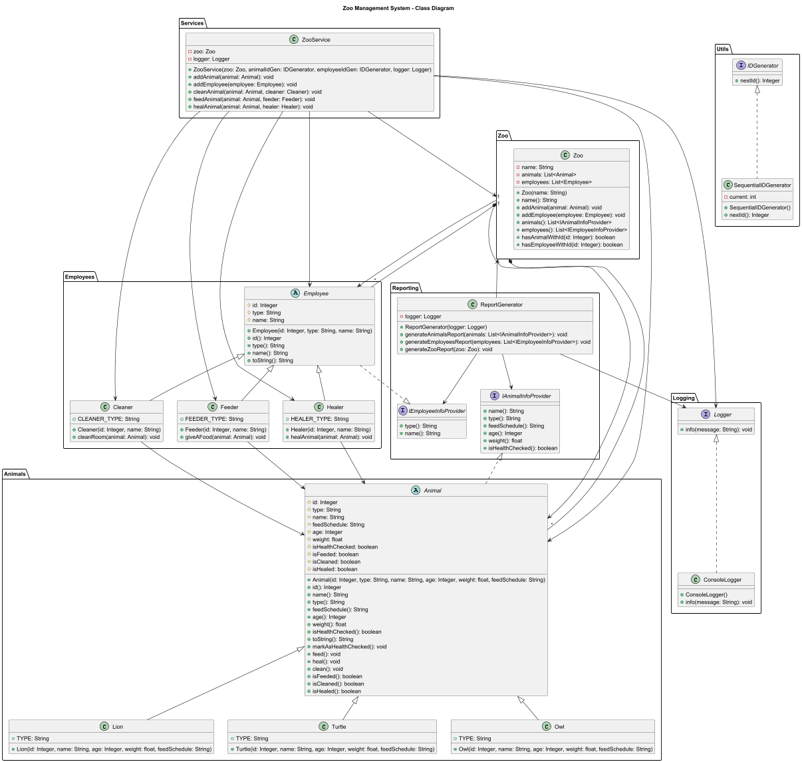

# Simple_ZOO
Educational project - implementation of Zoo.Zoo architecture with Java

# Описание предметной области: что моделирует программа  

Подсистема, отражающая базовые аспекты функционирования зоопарка, с применением принципов SOLID  
для обеспечения расширяемости, читаемости и возможности сопровождения кода.

Программа позволяет создать зоопарк, добавить в него животных и работников, а также вывести сводный отчет.  

# Как каждый из пяти принципов SOLID был реализован  

## Single Responsibility Principle  
Каждый класс — одна ответственность: 
- Zoo, Animal, Employee — данные,
- ZooService — логика, 
- Logger — вывод, 
- ReportGenerator - создание отчетности  

## Open/Closed Principle  
Животные: можно добавить новый тип животного, унаследовав от Animal  
Сотрудники: можно добавить новый тип сотрудника, унаследовав от Employee  
Отчеты: ReportGenerator работает с интерфейсами, поэтому можно добавлять новые типы животных/сотрудников без изменения кода генератора отчетов

## Liskov Substitution Principle  
Все наследники Animal корректно реализуют абстрактные методы feed(), heal(), clean()  
Наследники Employee корректно реализуют интерфейс IEmployeeInfoProvider  
Можно безопасно использовать любой подкласс вместо родительского класса  

## Interface Segregation Principle  
IAnimalInfoProvider содержит только методы для получения информации о животном  
IEmployeeInfoProvider содержит только методы для получения информации о сотруднике  
Logger занят только выводом информации  
Интерфейсы не перегружены лишними методами  

## Dependency Inversion Principle
Все зависимости (Logger, IDGenerator) — через интерфейсы, внедрены в конструктор

# Ситуации, при которых появятся проблемы добавления нового функционала или расширении бизнес-логики  
Жёсткая привязка состояния животного к конкретным булевым флагам.  
У животного есть разные признаки:  
```bash
protected boolean isHealthChecked;
protected boolean isFeeded;
protected boolean isCleaned;
protected boolean isHealed;
```
В текущей реализации невозможно добавить новые состояния (например, isVaccinated, isInQuarantine) без изменения базового класса Animal.  

# Аргументы, почему введенные абстракции улучшили качество дизайна  
1. Интерфейсы IAnimalInfoProvider и IEmployeeInfoProvider — чёткое разделение ответственности. Отчётный модуль (ReportGenerator) не зависит от конкретных классов (Lion, Cleaner), а только от контрактов.  
2. Абстрактные классы Animal и Employee — поддержка полиморфизма и расширения. Новые виды животных (тигр, зебра) и сотрудников (ветеринар, кормщик) добавляются без изменения существующего кода.  
3. Интерфейс IDGenerator — инкапсуляция механизма генерации. Генерация ID вынесена из бизнес-объектов → Animal и Employee не знают, как создаются их ID. Можно легко заменить SequentialIDGenerator на другие типы.  
4. Класс Zoo как агрегат — инкапсуляция данных.  
5. Сервисный слой (ZooService) — выделение бизнес-логики. Вся логика добавления, очистки, кормления сосредоточена в одном месте.  


